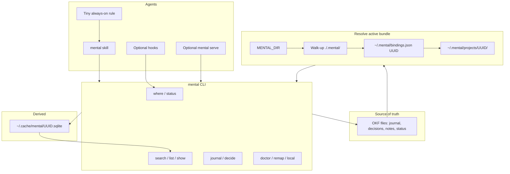

# Mental — standalone product (verbose execution plan)

This document is the **source of truth for the next agent session**. After approval, that session must:

1. Create `/home/ali/Development/Projects/mental` as **its own git repository** (own product, own GitHub). On disk it sits next to Balakit only because both live under `Projects/` — **not** because Mental remains a Balakit subproject. **Do not nest it inside the Balakit tree.**
2. `git init`, MIT license, `README.md` pointing at this spec.
3. **Copy this entire plan verbatim into `PLAN.md` at the repo root** (plus `docs/` mirrors if useful). Do not summarize away detail.
4. **Create a public GitHub repository on the personal account `afaraha8403`, never under the `balacodeio` org.** Canonical URL: `https://github.com/afaraha8403/mental`. `git remote add origin git@github.com:afaraha8403/mental.git` (or HTTPS), `git push -u origin main`.
5. Implement Mental CLI in that repo (phases 0–6).
6. **Then deprecate Mental out of Balakit** (phase 8, required — not optional). Balakit must stop shipping Mental skill/rule/plugin/CLI flags. Point users at `@mental/cli` / `github.com/afaraha8403/mental`. User `.mental/` data is never deleted.

### GitHub hosting (personal, public)

- **Owner:** `afaraha8403` (personal). **Visibility:** public.
- **Forbidden:** `balacodeio/mental`, any org under `balacodeio`, transferring the repo to the org without an explicit later ask.
- **Create command (executing agent):** `gh repo create afaraha8403/mental --public --source=/home/ali/Development/Projects/mental --remote=origin --push` after local init + first commit. If `gh` is logged into an org token, **switch to personal**: `gh auth login` as `afaraha8403` (this machine’s `GITHUB_TOKEN` was invalid at plan time). Confirm `gh api user --jq .login` prints `afaraha8403` **before** `repo create`.
- `package.json` `repository.url`: `https://github.com/afaraha8403/mental.git`. Same for `homepage` / `bugs`.
- LICENSE MIT is correct for a public personal repo. Do **not** put secrets, `~/.mental` dumps, or Balakit private notes in the public tree. `PLAN.md` is product spec (OK to be public).

**Decision already made (do not reopen unless a Must breaks):** Option A (home-canonical OKF + CLI-first agents), absorbing Option B’s **stable UUID identity** and **MCP as a peer**, rejecting overlay-by-default and hooks-on-by-default.

**Inspiration to steal (pattern, not vendor lock-in):** [okf-tools](https://github.com/hdean-ssp/okf-tools) — files remain SoT; SQLite sidecar is gitignored and rebuildable; hybrid search later. [Graphify](https://github.com/Graphify-Labs/graphify) — Skill + tiny always-on rule tell agents to shell the CLI; MCP optional.

---

## 1. Problem, product, non-goals

### Problem

Today Mental is a **Balakit personal capability**: skill + always-on rule + gitignore policy. Data lives in **per-repo `.mental/`**. Agents **read/write markdown and YAML directly**. As the OKF bundle grows, grep is noisy (frontmatter keys vs body vs tags). Continuity is trapped in one clone; moving a repo orphans the “where” story unless the folder moves with it. Balakit `doctor` owns ignore setup. That coupling blocks Mental as its own product.

### Product

**Mental** is a local-first continuity layer for a human and their coding agents:

- **OKF markdown + YAML frontmatter** is the only source of truth.
- A **derived SQLite index** answers structured queries (type, status, tags, FTS, links).
- **Default store is user-global** (`~/.mental/`), partitioned per project identity.
- A **project may break off** into `./.mental/` (exclusive nearest-wins; no silent merge of personal + project).
- Humans use a **CLI** (TTY menu or commands). Agents use the **same CLI with `--json`**, instructed by a **tiny always-on rule** + a **Skill**. Hooks and MCP are **optional**.

### Reader of `.mental/`

The **user** (and future-them in two weeks). The agent is a scribe. Write for a human, not for RAG dumps.

### Musts

- OKF files remain SoT. Deleting the sqlite file must not lose knowledge.
- Default data location: home. Project-local only after explicit `mental local`.
- **Exclusive** active bundle: never auto-overlay personal journal into a project session.
- Agents **must not grep** OKF; they call `mental … --json`.
- Identity **survives path change** (UUID, not filesystem path, not raw origin URL as id).
- Works **without** hooks, MCP, or even a successful index (fallback: read files via CLI still).
- Private by default; never store secrets; never commit `~/.mental` or project `.mental/` unless the user later opts into tracked (out of v1 if it complicates).
- Missing Mental **must not block coding** (fail open).
- Uninstall **must not delete OKF** without a typed confirmation phrase.
- Existing Balakit users with `./.mental/`: **dual-read**, **single-write**, until they import.

### Non-goals (v1)

- Hosted SaaS, Neo4j, Graphify as store, vector DB as SoT.
- Replacing git, GitHub issues, READMEs, or task managers.
- Silent merge of all projects into one context window.
- Auto-journal on every agent Stop hook.
- Windows-first polish (must not break POSIX; Windows PATH/home is a test later).
- Keeping Mental as a Balakit-owned capability. **Deprecation in Balakit is in scope** (after CLI exists so users have somewhere to go).

---

## 2. Architecture




**Layers (never invert):**

1. **OKF files** — SoT.
2. **Resolver** — which directory is active (`mental where`).
3. **CLI** — only supported write path; `--json` for agents.
4. **Index** — cache. Rebuild from files.
5. **Skill / rule / hooks / MCP** — tell agents to use (3), never to parse YAML themselves.

---

## 3. On-disk layout

### 3.1 User store (default)

```text
~/.mental/
  mental.toml                 # user config: privacy, editor, default mode
  bindings.json               # UUID ↔ origins[], paths[], name
  journal/                    # cross-project personal journal (only when active root is ~/.mental itself)
  notes/
  decisions/
  index.md                    # OKF bundle index
  log.md                      # optional OKF log
  projects/
    <uuid>/
      index.md
      status/current.md
      journal/YYYY-MM-DD.md
      decisions/YYYY-MM-DD-slug.md
      notes/slug.md
```

Use `**~/.mental**` (user asked for a `.mental` folder in home). Do **not** bikeshed XDG for the bundle root in v1. **Do** put the sqlite cache in XDG cache:

```text
${XDG_CACHE_HOME:-~/.cache}/mental/<uuid>.sqlite
${XDG_CACHE_HOME:-~/.cache}/mental/<uuid>.sqlite-wal
```

Never commit cache. `mental doctor` rebuilds it.

### 3.2 Project-local store (opt-in)

```text
<repo>/.mental/               # same OKF shape as a project slice
<repo>/.mental-id             # optional, gitignored, uuid only (remap hint)
```

Default git policy for `./.mental/` and `.mental-id`: **not tracked**. Installer may append to user global gitexcludes (same spirit as today’s `global-exclude` in [bin/lib/mental-policy.mjs](bin/lib/mental-policy.mjs)) **only via `mental doctor --fix-ignore`**, never silently from the skill. Skill/agent **must not** edit `.gitignore`.

### 3.3 OKF concept types (keep Mental’s current vocabulary)

Port templates from [skills/mental/references/templates.md](skills/mental/references/templates.md):


| `type` (required) | Path                           | `status` values                                |
| ----------------- | ------------------------------ | ---------------------------------------------- |
| Journal           | `journal/YYYY-MM-DD.md`        | n/a (append-only sections)                     |
| Decision          | `decisions/YYYY-MM-DD-slug.md` | `open` | `deferred` | `decided` | `superseded` |
| Note              | `notes/slug.md`                | `draft` | `active` | `superseded`              |
| Status            | `status/current.md`            | regenerated cache, not SoT                     |


Frontmatter: `type` required; recommend `title`, `description`, `timestamp`, `tags`. Paths are identities (don’t rename to “archive”). Links are relative markdown links.

**Journal section contract** (keep):

```text
## HH:MM — <outcome>
<what changed, evidence, decisions git cannot explain>

Resume: <one exact next action> — open loops: <none or list>
```

One section per coherent **task**, not per chat turn. Skip trivial/read-only turns.

---

## 4. Bundle resolution (must be deterministic)

`mental where` prints path, uuid, mode, reason. Agents call this first.

**Order:**

1. If `MENTAL_DIR` is set and is a directory → that path, mode `env`.
2. Walk from `cwd` to git root (or filesystem root, stop at `$HOME`). If `<dir>/.mental/` exists as a **directory** → that path, mode `local`.
3. Else if git repo: compute binding (section 5). Active path = `~/.mental/projects/<uuid>/` (create skeleton on first write, not necessarily on `where`).
4. Else (not a git repo): `~/.mental` personal root, mode `personal`.

**Exclusive:** never concatenate personal + project trees in `status`/`search` unless a later flag `--also-personal` is implemented (not v1).

**Dual-read / single-write (migration):**

- If **both** `./.mental/` (legacy Balakit) **and** a home binding exist: `where` reports **local** (walk-up wins) so existing users keep working.
- `mental doctor` warns: “legacy local bundle; run `mental local --import` from home or keep local.”
- **Writes** go only to the resolved root. Never write to two trees.

---

## 5. Identity and remap (UUID, not origin)

**Do not use git origin as the id.** Origin is a hint.

`~/.mental/bindings.json` (array of objects):

```json
{
  "version": 1,
  "bindings": [
    {
      "id": "9f3c0a1e-…",
      "name": "balakit",
      "origins": ["github.com/balacodeio/balakit"],
      "paths": ["/home/ali/Development/Projects/balakit"],
      "updatedAt": "2026-08-24T21:00:00Z"
    }
  ]
}
```

Normalize origins: strip `.git`, lowercase host, strip userinfo, treat `git@github.com:org/repo` ≡ `https://github.com/org/repo`.

**Resolve uuid for a git worktree:**

1. If `./.mental-id` exists and matches a binding → use it; append cwd to `paths` if new.
2. Else unique match on normalized origin → use it; append path.
3. Else unique match on cwd in `paths` → use it (repo moved, origin same or not yet updated).
4. Else **fork heuristic:** origin is new but `upstream` matches an existing origin → **do not auto-bind**. Print: `mental remap --from <id>` or `mental new` (new uuid).
5. Else no match → **create new uuid**, record origin+path. First `status`/`journal` creates `projects/<uuid>/`.
6. Ambiguous (two bindings share origin — user ran `split` wrong, or copy-paste) → refuse to guess; `mental remap`.

**Commands:**

- `mental remap` — interactive: pick binding for this cwd.
- `mental split` — this clone gets a **new** uuid (copy or empty).
- `mental link` — point this cwd at an existing uuid (second clone of same project).

**Default for two clones of the same origin:** **share uuid** (same project brain). User `split` if they want divergence.

**Tests (non-negotiable before calling remap “done”):**

- `mv` repo, origin unchanged → same uuid.
- origin SSH ↔ HTTPS → same uuid.
- two clones, same origin → same uuid.
- fork (origin ≠ old, upstream = old) → no silent inherit.
- `git init` no origin → uuid by path; adding origin later **merges** if that origin already bound (prompt if conflict).
- git worktree → same uuid as main worktree.
- monorepo `cwd=packages/foo` → bind **git root**, not package dir.

Optional `./.mental-id`: write on first bind, add to global exclude. Helps remap before git is available.

---

## 6. CLI surface

**Package:** Node **ESM**, `bin` name `mental`. Suggested npm name `@mental/cli` (plain `mental` is likely taken — **check npm at implement time** and set `"bin": { "mental": "bin/cli.mjs" }`).

**Runtime:** Node `>=18`. Dependencies: keep lean. Suggested: `@clack/prompts` (Balakit already uses it), `better-sqlite3` or `node:sqlite` if Node version allows — prefer **sql.js / better-sqlite3** with a documented native-build fallback. If native modules are painful, v1 search can be **in-process scan of frontmatter + ripgrep-like filter** and sqlite in v1.1. **Do not block v1 on vectors.**

**No args + TTY:** interactive menu (Where, Status, Search, Journal, Local, Remap, Doctor, Hooks, Quit). **No args + not TTY:** print help, exit 2.

**Global flags:** `--json`, `--dir <path>` (overrides resolve, like `MENTAL_DIR`), `--help`, `--version`.


| Command                                        | Behavior                                                                                                                                                |
| ---------------------------------------------- | ------------------------------------------------------------------------------------------------------------------------------------------------------- |
| `mental where`                                 | Active root, uuid, mode, reason                                                                                                                         |
| `mental status`                                | Regenerated view: git snapshot + latest Resume + open/deferred decisions. Writes `status/current.md` as cache.                                          |
| `mental search <q>`                            | Index or file scan; `--type`, `--status`, `--tag`                                                                                                       |
| `mental list`                                  | Concepts with filters                                                                                                                                   |
| `mental show <path>`                           | One file, relative to bundle root                                                                                                                       |
| `mental journal [--title] [--resume]`          | Append today’s journal section (or open editor). Agents pass `--title` `--body` `--resume` `--json`.                                                    |
| `mental decide`                                | Scaffold a decision file                                                                                                                                |
| `mental note`                                  | Scaffold a note                                                                                                                                         |
| `mental local [--import | --move]`             | Create `./.mental/`. `--import` copies home slice. `--move` copies and stops using home for this uuid (keep files in home unless user confirms delete). |
| `mental remap` / `split` / `link`              | Identity                                                                                                                                                |
| `mental doctor`                                | One writer, ignore policy, index age, PATH, skill install presence                                                                                      |
| `mental install [--project] [--hooks] [--mcp]` | Copy skill+rule to user agent dirs; optional project vendor; optional hooks; optional MCP config snippet                                                |
| `mental hooks on|off`                          | User-level Claude/Cursor hook snippets calling `mental status --json`                                                                                   |
| `mental serve`                                 | Optional MCP stdio wrapping the same commands                                                                                                           |
| `mental uninstall`                             | Remove installed skills/rules/hooks from **user** agent dirs. Does **not** delete `~/.mental` unless `--delete-data` + typed `DELETE`.                  |
| `mental reindex`                               | Rebuild sqlite from files                                                                                                                               |


**Agent JSON shape (stable):** always `{ "ok": true, "data": … }` or `{ "ok": false, "error": { "code", "message" } }`. `where` data: `{ root, id, mode, reason, gitRoot }`.

**Exit codes:** 0 ok, 1 usage/resolve error, 2 no TTY help, 3 doctor found problems (still print JSON).

---

## 7. Index (steal okf-tools, implement small)

v1 schema (illustrative):

- `concepts(path PK, type, title, status, tags_json, mtime, body_text)`
- `links(src, dest, raw)`
- FTS5 on `title + body_text`

Rebuild: walk `*.md` except `index.md`/`log.md` special cases per OKF. Incremental: skip unchanged mtime.

If `better-sqlite3` is too heavy for first merge: implement `search` as gray-matter parse + substring, with `--json`, and leave sqlite behind a `mental reindex` stub. **Prefer sqlite in v1** if install is smooth.

**No embeddings in v1.** Optional later (`sqlite-vec` + local model), same DB.

---

## 8. Agent contract: skill, rule, hooks, MCP

### 8.1 Skill vs rule (doctrine)

From [skills/authoring-skills-and-rules](skills/authoring-skills-and-rules/SKILL.md):

- **Skill** = procedure (when to journal, commands, privacy). Model-invocable + user `/mental`.
- **Rule** = ~8 lines always-on **pointer**. Not the full lifecycle (today’s [rules/mental.mdc](rules/mental.mdc) is too fat — shrink it).

### 8.2 Tiny rule (copy into user AGENTS.md / CLAUDE.md managed block + Cursor `alwaysApply`)

Approximate text:

- Continuity is Mental. On start/finish of real work, or orientation questions, use the Mental skill.
- Run `mental where` then `mental status --json` (or `search --json`). Do not grep `.mental` or `~/.mental`.
- If `mental` is not on PATH, try `npx @mental/cli …`. If that fails, continue the user’s coding task and mention install.
- Never commit Mental data. Never write secrets. Never edit gitignore; tell the user to run `mental doctor`.

### 8.3 Skill body (port from [skills/mental/SKILL.md](skills/mental/SKILL.md), rewrite)

**Delete:** Balakit `installed.json`, `npx balakit doctor`, “read YAML files yourself.”

**Add:** CLI-first; `--json`; journal at **task boundary**; derive from git + Resume + open decisions via `status`; create decisions only when they constrain the future; notes only if durable.

**Triggers:** same as today (orientation, start/finish substantive work, decisions).

**Install targets** (`mental install`):

- `~/.claude/skills/mental/SKILL.md` (+ references)
- `~/.cursor/skills/mental/`
- `~/.agents/skills/mental/`
- Optional: `.github/skills/mental` only with `--project`

Mirror layout like Balakit: **one source** in the mental repo `skills/mental/`, copy to user dirs. Do not maintain five hand-edited copies in the product repo beyond documented mirrors if you use a tiny `scripts/install-skills.mjs`.

### 8.4 Hooks (optional, default off)

`mental hooks on` writes **user** hooks:

- Claude Code: SessionStart + PreCompact → `mental status --json` (cap output, e.g. 2–4 KB).
- Cursor: `~/.cursor/hooks.json` sessionStart — **best-effort**. Known bug: `additional_context` may drop. Document that the **skill+rule** are the real contract.

Never Stop auto-journal.

### 8.5 MCP (optional)

`mental serve`: tools `where`, `status`, `search`, `show`, `journal` wrapping CLI functions in-process (don’t spawn a nested CLI if you can import lib). Register via `mental install --mcp`. Agents View likes tools; still keep CLI for everyone else.

---

## 9. Privacy and gitignore

v1: **always private.**

- Home bundle: never an install-time git question.
- Project `.mental/`: `mental doctor --fix-ignore` may add `mental/` / `.mental/` to **user global excludes** (same as Balakit `global-exclude`). Do **not** have the agent edit `.gitignore`.
- Skill: if creating `./.mental/` and `git check-ignore` fails, **refuse create**, tell user `mental doctor --fix-ignore`.

Tracked/shared Mental is a later policy flag (Balakit already has `tracked` / `repo-gitignore`). Do not implement four policies on day one unless copying [bin/lib/mental-policy.mjs](bin/lib/mental-policy.mjs) is cheaper than arguing — **prefer one private path in v1**.

---

## 10. Install, doctor, uninstall

**Human:**

```bash
npm i -g @mental/cli    # or npx
mental install          # skills + tiny rule, user-global; creates ~/.mental skeleton
```

`**mental install --project`:** vendor skill into the current repo (team shares procedure, not data).

**Doctor checks:** binary on PATH; active `where`; bindings sane; ignore for local mode; index mtime; skills present in at least one agent dir; two-writer warning.

**Uninstall:** remove skill/rule/hooks copies Mental installed (leave user edits to AGENTS.md with a managed begin/end comment, same idea as Balakit `BEGIN`/`END` in [bin/lib/pkg.mjs](bin/lib/pkg.mjs)). Data stays.

---

## 11. Edge cases (implement as tests where possible)


| Case               | Behavior                                                          |
| ------------------ | ----------------------------------------------------------------- |
| `MENTAL_DIR`       | Wins                                                              |
| Legacy `./.mental` | Local wins                                                        |
| Repo `mv`          | Rebind path                                                       |
| Two clones         | Shared uuid                                                       |
| Fork               | Prompt / new uuid                                                 |
| Not git            | Personal `~/.mental`                                              |
| Monorepo subdir    | Git root                                                          |
| Sandbox no HOME    | Fail open; no writes                                              |
| Cloud agent        | No home store; skip                                               |
| Stale index        | Rebuild on mtime mismatch                                         |
| Uninstall          | No data delete                                                    |
| Secrets in files   | Don’t scan-for-secrets in v1 beyond “never write tokens” in skill |


---

## 12. New repo layout (`/home/ali/Development/Projects/mental`)

```text
PLAN.md                 # this plan, verbatim
README.md               # install + mental where/status/search + privacy
LICENSE                 # MIT
package.json
bin/cli.mjs             # argv router
bin/commands/*.mjs      # where, status, search, journal, local, remap, doctor, install, hooks, serve
bin/lib/resolve.mjs     # bundle resolution
bin/lib/bindings.mjs
bin/lib/okf.mjs         # parse/write frontmatter, templates
bin/lib/index.mjs       # sqlite or scan
bin/lib/git.mjs         # origin normalize, git root
bin/lib/install-skills.mjs
skills/mental/SKILL.md
skills/mental/references/templates.md
rules/mental.mdc        # tiny alwaysApply pointer (Cursor source)
hooks/session-start.sh  # calls mental status --json
test/*.test.mjs         # resolve, bindings, origin normalize (node:test)
.gitignore              # node_modules, .sqlite
```

**Do not** copy Balakit’s whole installer. Steal only Mental-relevant snippets: templates, journal contract, privacy wording, ignore-check pattern.

---

## 13. Deprecate Mental from Balakit (required)

Mental **leaves Balakit**. The new repo is the only product. Balakit must not keep a fork of the skill.

**Order:** ship a working `mental` CLI + install path first (phases 0–3 minimum), **then** change Balakit in a **separate Balakit commit/PR** so users are never left with no installer.

**Balakit changes (phase 8):**

- Changelog `[Unreleased]` **Changes:** Mental is deprecated; install `@mental/cli` / see `https://github.com/afaraha8403/mental`.
- README / kit description: drop “flexible Mental continuity layer” as a Balakit feature.
- Remove personal Mental from the installer: `PERSONAL_RULES`, `RULE_BUNDLED_SKILLS.mental` in [bin/lib/pkg.mjs](bin/lib/pkg.mjs); `mentalTooling` / `mentalDataPolicy` flags in [bin/cli.mjs](bin/cli.mjs) / [bin/commands/init.mjs](bin/commands/init.mjs); [bin/lib/mental-policy.mjs](bin/lib/mental-policy.mjs), [bin/lib/mental-exclude.mjs](bin/lib/mental-exclude.mjs); doctor/status branches that exist only for Mental.
- Delete (or replace with a one-line stub that says “moved”) [skills/mental](skills/mental), [rules/mental.mdc](rules/mental.mdc), mirrors under `.cursor/skills/mental`, `.claude/skills/mental`, `.agents/skills/mental`, and [plugins/balakit-mental](plugins/balakit-mental). Run the existing plugin/sync scripts so generated files do not resurrect Mental.
- Tests: drop Mental-policy install tests; keep ignore/doctor tests only if they still apply to other features.
- Generated `AGENTS.md` / `CLAUDE.md` templates: remove Mental always-on blocks.
- Optional compatibility: if `balakit add mental` remains, it should **fail with a message** (or exec `npx @mental/cli install`) — do not keep shipping the old skill.

**Do not:** delete anyone’s `~/.mental` or repo `.mental/` data. Deprecate **tooling in Balakit**, not user journals.

**Do not:** put the Mental CLI *inside* the Balakit git repo. Own git root + own GitHub (`afaraha8403/mental`).

---

## 14. Implementation phases (execute in order)

### Phase 0 — Repo, this plan, and public GitHub

- `mkdir /home/ali/Development/Projects/mental`
- `git init -b main`
- Write `PLAN.md` (full text of this plan)
- `README.md` stub (link `https://github.com/afaraha8403/mental`), `LICENSE`, `package.json` (`repository`: `afaraha8403/mental`)
- `.gitignore`
- First commit
- Verify `gh api user --jq .login` is `afaraha8403` (not an org)
- `gh repo create afaraha8403/mental --public --source=. --remote=origin --push`
- **Do not** create `balacodeio/mental`

### Phase 1 — Resolver + where

- `resolve.mjs`, `bindings.mjs`, `git.mjs`
- `mental where` human + `--json`
- Tests: origin normalize, walk-up `.mental`, `MENTAL_DIR`, git root vs nested cwd

### Phase 2 — OKF skeleton + status + journal

- Create home/project slice templates (from current Mental templates)
- `mental status` (git + last Resume + open decisions; write `status/current.md`)
- `mental journal` append
- `mental decide` / `mental note` scaffolds
- Port skill **CLI-first** into `skills/mental/SKILL.md`
- Tiny `rules/mental.mdc`

### Phase 3 — install + doctor

- Copy skill/rule to `~/.claude`, `~/.cursor`, `~/.agents` (and AGENTS.md/CLAUDE.md managed blocks if you can do it safely)
- `mental doctor`
- Ignore check before creating `./.mental`

### Phase 4 — search

- sqlite FTS or file scan + filters `--type --status --tag`
- `mental reindex`

### Phase 5 — local / remap / split / link

- Full identity tests
- `mental local --import|--move`

### Phase 6 — optional hooks + MCP

- Default off
- `mental serve` if time

### Phase 7 — polish (Mental repo)

- TTY menu
- `uninstall`

### Phase 8 — deprecate Mental in Balakit (required)

Work in `/home/ali/Development/Projects/balakit` **after** Mental CLI install works:

- CHANGELOG + README: Mental moved to `github.com/afaraha8403/mental`
- Remove installer/policy/plugin/skill/rule/mirrors/tests as listed in §13
- `./sync` / plugin build so copies do not come back
- Do not wipe user `.mental/` data
- README: how humans and agents use it; remap; fail-open

**Minimum shippable:** Phases 0–3 + journal/status/where + CLI-first skill. Search/index can follow immediately but `where`+`status`+skill rewrite is the de-risk spike from deliberation.

---

## 15. Testing and acceptance

- `node --test` for resolver/bindings (no network).
- Manual: install, `where` in a git repo, `journal`, move directory, `where` same uuid.
- Agent acceptance: skill installed, agent asked “where did we leave off?” → must run `mental status --json` (or skill that does), **not** Grep on `Resume:`.

---

## 16. Documentation the next agent should write in-repo

- `README.md` — install, commands, privacy, “agents use --json”.
- `PLAN.md` — this file (do not replace with a short summary).
- Skill `when_to_use` — orientation, handoff, decisions.

---

## 17. Explicit non-actions

- Do not publish to npm until the user asks.
- Do not create or push to **`balacodeio/*`**. GitHub owner is **`afaraha8403`** only.
- Do not leave Mental living as a Balakit feature after phase 8 (deprecate it).
- Do not nest the Mental git repo inside Balakit.
- Do not delete user `.mental/` data when removing Balakit tooling.
- Do not enable hooks by default.
- Do not overlay personal + project search in v1.
- Do not use Graphify `graph.json` as SoT.
- Do not commit `.mental/` user data or tokens to the public repo.

