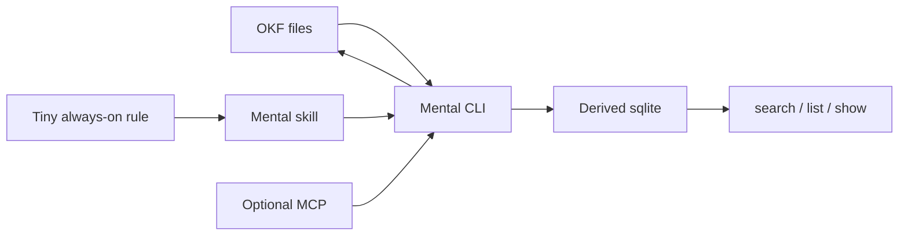

# Why Mental CLI

You should not have to reconstruct a project from chat history.

That reconstruction is the fatigue: mental fry from orchestrating several projects and several agents. The 2024–2026 literature calls the mechanisms **supervisory engineering work**, **verification load**, and **stealth context switching**. Mental CLI is the external cue that hop needs — the control surface git cannot see.

Git already records **what** changed. The expensive part of a hop — a weekend, a new agent, a second clone — is the rest: where you left off, why a decision was made, what is still in the air, and the next exact action. That is the only thing Mental stores.

Write for the human who comes back in two weeks. **The agent is the scribe** — after install, agents call the CLI while you work. You do not have to journal by hand. **I type mental.** You type `mental` for the pulse.

Citations: [The research](./research.md).

## Git vs Mental CLI

| Git knows | Mental CLI knows |
| --- | --- |
| Files and diffs | Current focus |
| Commit messages | Why a choice constrains the future |
| Branch / dirty | Residue still in the air after a hop |
| History | One exact resume line |

Mental CLI does not replace git, issues, or `PLAN.md`. It holds the small amount those systems cannot see.

## The contract

1. **OKF markdown is the source of truth.** Deleting the sqlite file must not lose knowledge.
2. **The CLI is the write path.** Humans type `mental`. Agents call `mental … --json`.
3. **Home by default.** Data lives in `~/.mental`, partitioned by a UUID. Project `./.mental` only after `mental local`.
4. **Identity survives a move.** Two clones of the same origin share one brain until you `split`.
5. **Fail open.** Missing Mental CLI must not block coding.
6. **Private by default.** Never commit the store. Never write secrets.

Layers never invert: files → resolver → CLI → index → skill / rule / hooks / MCP.

## What Mental CLI is not

- Not a todo app, GTD system, or issue tracker
- Not a chat transcript store — extract residue, throw the dump away
- Not a second `PLAN.md` — point at the plan with `--against`, do not copy it
- Not a secret store
- Not a hosted SaaS, vector database, or graph as source of truth
- Not a standing TUI. `mental` prints a pulse and exits.
- Not a reconstruction from git. Optional Track is a default-off automated project-time record: private/customer descriptions, wall/billable, and dated client export. [Track](./track.md).

## Vocabulary

| Type | Path | When to write |
| --- | --- | --- |
| Journal | `journal/YYYY-MM-DD.md` | One section per real task boundary |
| Decision | `decisions/YYYY-MM-DD-slug.md` | A choice that constrains the future |
| Attention | `attention/YYYY-MM-DD-slug.md` | Residue in the air (direction, concern, thread, verify) |
| Note | `notes/slug.md` | A durable fact that saves future investigation |
| Status | `status/current.md` | Disposable cache. Not SoT. |

Heartbeat shows at most **7** open or later attention items (`verify` first, as Needs eyes). `--status later` is "come back to this" — not a note, not a second command. TTY splits Later from In the air. Residue that cannot close is a graveyard — resolve it. Settled lists newest decided titles (cap 7). `Hops` is parks today.

See [identity](./identity.md) for how a repo finds its brain, and the [CLI reference](./cli.md) for the write commands.
